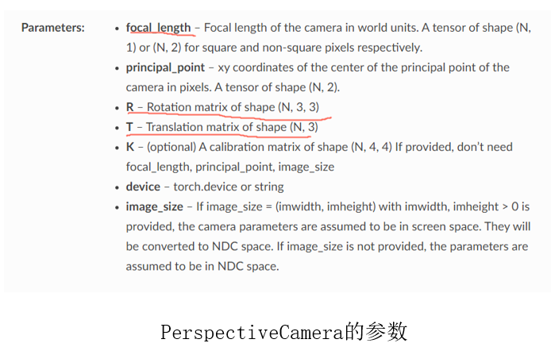

  

- focal length 是在world units？
- N是什么意思？batch?
- principal point是什么？
- NDC space是什么？screen space是什么？

def imread(f):
    if f.endswith('png'):
        return imageio.imread(f, ignoregamma=True)
    else:
        return imageio.imread(f)

imgs = [imread(f)[...,:3]/255. for f in imgfiles]

