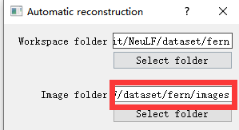
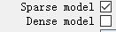

- [1. download](#1-download)
- [2. usage](#2-usage)
  - [2.1. Automatically reconstruct is all you need](#21-automatically-reconstruct-is-all-you-need)
  - [2.2. cli](#22-cli)

## 1. download

Executables for Windows and Mac and other resources can be downloaded from https://demuc.de/colmap/. 

Executables for Linux/Unix/BSD are available at https://repology.org/metapackage/colmap/versions.

## 2. usage

```bash
COLMAP-3.8-windows-cuda
├─bin
|   └─colmap.exe
├─lib
|   └─...
└─COLMAP.bat
```
不是执行colmap.exe，而是COLMAP.bat，直接点击是GUI，命令行是`COLMAP.bat -h`


### 2.1. Automatically reconstruct is all you need

Assuming you stored the images of your project in the following structure:

```bash
/path/to/project/...
+── images
│   +── image1.jpg
│   +── image2.jpg
│   +── ...
│   +── imageN.jpg
```

1. Click `Reconstruction > Automatic Reconstruction` in the GUI.
2. select `path/to/project` as a **workspace folder**, select `path/to/project/images` as a **image folder**。
    注意：不是`images_4`，用原始大小的。因为`_load_data`计算poses和bds时会除以传入的factor=4，所以colmap就该选没被处理过的原始图片。

      

3. The output is written to the workspace folder. The folder would look similar to this:
```bash
+── images
│   +── image1.jpg
│   +── image2.jpg
│   +── ...
+── sparse
│   +── 0
│   │   +── cameras.bin
│   │   +── images.bin
│   │   +── points3D.bin
│   +── ...
+── dense
│   +── 0
│   │   +── images
│   │   +── sparse
│   │   +── stereo
│   │   +── fused.ply
│   │   +── meshed-poisson.ply
│   │   +── meshed-delaunay.ply
│   +── ...
+── database.db
```
  
可以去掉Dense model，因为nerf用不到。

我们要的结果：
- `sparse/0/`下的`cameras.bin`, `images.bin`, `points3D.bin`
### 2.2. cli

The command for the automatic reconstruction tool would be:

```bash
# The project folder must contain a folder "images" with all the images.
$ DATASET_PATH=/path/to/project

$ colmap automatic_reconstructor \
    --workspace_path $DATASET_PATH \
    --image_path $DATASET_PATH/images
```

```bash
# The project folder must contain a folder "images" with all the images.
$ DATASET_PATH=/path/to/dataset

$ colmap feature_extractor \
   --database_path $DATASET_PATH/database.db \
   --image_path $DATASET_PATH/images

$ colmap exhaustive_matcher \
   --database_path $DATASET_PATH/database.db

$ mkdir $DATASET_PATH/sparse

$ colmap mapper \
    --database_path $DATASET_PATH/database.db \
    --image_path $DATASET_PATH/images \
    --output_path $DATASET_PATH/sparse

### 对于Nerf，基本到此就不用了

$ mkdir $DATASET_PATH/dense

$ colmap image_undistorter \
    --image_path $DATASET_PATH/images \
    --input_path $DATASET_PATH/sparse/0 \
    --output_path $DATASET_PATH/dense \
    --output_type COLMAP \
    --max_image_size 2000

$ colmap patch_match_stereo \
    --workspace_path $DATASET_PATH/dense \
    --workspace_format COLMAP \
    --PatchMatchStereo.geom_consistency true

$ colmap stereo_fusion \
    --workspace_path $DATASET_PATH/dense \
    --workspace_format COLMAP \
    --input_type geometric \
    --output_path $DATASET_PATH/dense/fused.ply

$ colmap poisson_mesher \
    --input_path $DATASET_PATH/dense/fused.ply \
    --output_path $DATASET_PATH/dense/meshed-poisson.ply

$ colmap delaunay_mesher \
    --input_path $DATASET_PATH/dense \
    --output_path $DATASET_PATH/dense/meshed-delaunay.ply
```

use CPU-based feature extraction and matching by setting the `--SiftExtraction.use_gpu 0` and `--SiftMatching.use_gpu 0` options.


meaning: 
- `automatic_reconstructor`: Automatically reconstruct sparse and dense model for a set of input images.

- `project_generator`: Generate project files at different quality settings.

- `feature_extractor`, `feature_importer`: Perform feature extraction or import features for a set of images.

- `exhaustive_matcher`, `vocab_tree_matcher`, `sequential_matcher`, `spatial_matcher`, `transitive_matcher`, `matches_importer`: Perform feature matching after performing feature extraction.

- `mapper`: Sparse 3D reconstruction / mapping of the dataset using SfM after performing feature extraction and matching.

- https://colmap.github.io/cli.html#commands

