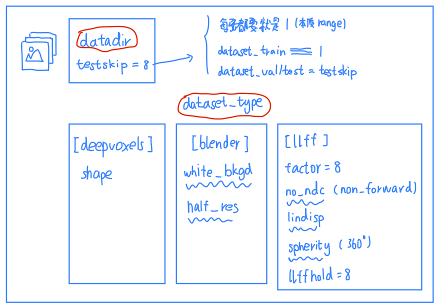
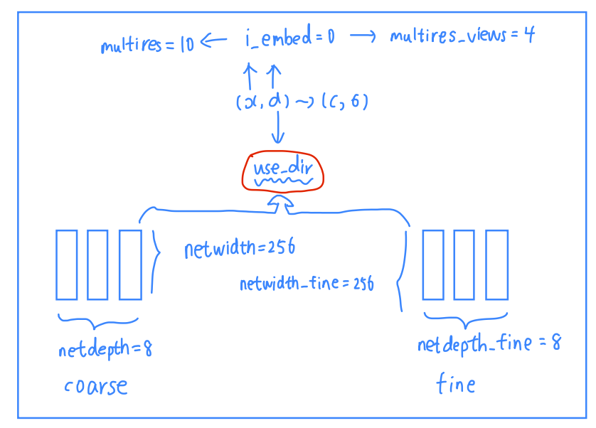
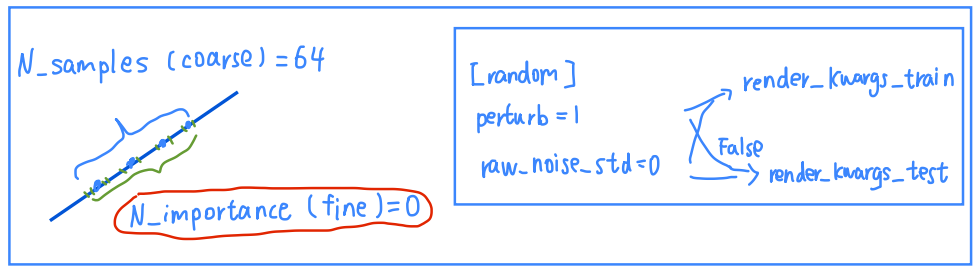
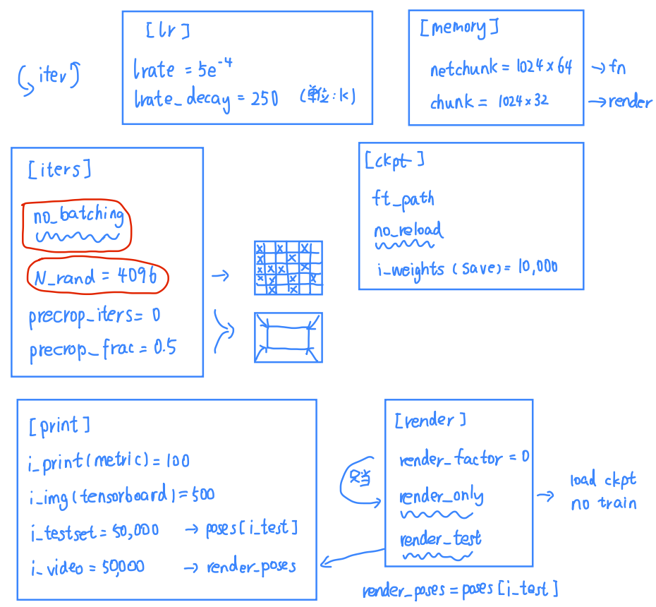

- [1. configs](#1-configs)
  - [1.1. Parts](#11-parts)
    - [1.1.1. Logs](#111-logs)
    - [1.1.2. Dataset](#112-dataset)
    - [1.1.3. MLP](#113-mlp)
    - [1.1.4. Integration](#114-integration)
    - [1.1.5. Iterations](#115-iterations)
      - [1.1.5.1. no\_batching](#1151-no_batching)
      - [1.1.5.2. precrop](#1152-precrop)
      - [1.1.5.3. ckpt](#1153-ckpt)
      - [1.1.5.4. quick start](#1154-quick-start)
      - [1.1.5.5. render\_poses](#1155-render_poses)

---
# 1. configs
波浪线表示 `store_true` 类型。

红色表示一般都要设置的类型。
## 1.1. Parts

### 1.1.1. Logs

  

### 1.1.2. Dataset

  

### 1.1.3. MLP

  

### 1.1.4. Integration

  

### 1.1.5. Iterations

  

#### 1.1.5.1. no_batching

<https://github.com/yenchenlin/nerf-pytorch/issues/6>

> bmild: `no_batching` here is just a matter of memory consumption, since the batching implementation is very simple, instantiating the camera ray for every pixel in the dataset in one very very large array and then shuffling. In practice we found that our learning rate was small enough that it didn't make a noticeable difference.

不直接使用`batch`，而是通过`N_rand`控制一张图片中随即采用的光线数量。

#### 1.1.5.2. precrop

<https://github.com/yenchenlin/nerf-pytorch/issues/5>
<https://github.com/bmild/nerf/issues/29>

> bmild: We did find that for the blender scenes with a lot of whitespace (Ficus and Mic) the training would sometimes diverge right at the beginning of training. One hack that helps with initial training stability for these scenes with a lot of background and a small object of interest is to crop out the central part of the image for training for just the first 1000 iters or so, so it's not being supervised on almost all white pixels at the start.

> yenchenlin: synthetic images have a large portion of white background and sampling those pixels too much may cause NeRFs to always predict white colors.

solution is `precrop` for
```
precrop_iters = 500
precrop_frac = 0.5
```

#### 1.1.5.3. ckpt

- `ft_path`: 指定加载，或者默认加载文件夹下最近的一次ckpt `xxx.tar`。
  在 `create_nerf()` 里 load ckpt, 而不是在 `train()`


- `no_reload`: 禁止默认load ckpt, 强制从头训练。

#### 1.1.5.4. quick start

```bash
ft_path = /path/to/trained.pt
render_only
# render_test
```

#### 1.1.5.5. render_poses

`render_poses` 本是从 `load_blender_data()` 返回的 spiral_poses，没有对应图片真值。
如果 `--render_test` ，那么 `render_poses` 就是测试集里的poses，有对应图片真值。

`i_video` 用的是 `render_poses`， `i_testset` 用的是 `poses[i_test]`