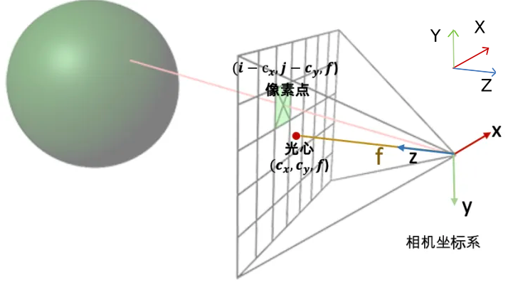

## get_rays

> 描述一个光线需要两个量，起点和方向。`view_ray =  ray_o + ray_d`才是一条指定起点的光线.

- `ray_o`起点: 原本在相机坐标系下，光线方向即为相机原点，则光线的起点就是(0,0,0)；现在放在世界坐标系下，**世界坐标下光线原点**的平移量 $t$ 为c2w的偏移量`(t_x, t_y, t_z)`。
- `ray_d`方向：在相机坐标系下, 从相机原点出发的向量`dirs`; 现在放在世界坐标系下，`dirs`与`c2w`的 $R$ 运算就得到了 **世界坐标下的光线方向** `rays_d`。


`rays_d`: 
```python
dirs = np.stack([(i-K[0][2])/K[0][0], -(j-K[1][2])/K[1][1], -np.ones_like(i)], -1)
# dot product, equals to: [c2w.dot(dir) for dir in dirs]
rays_d = np.sum(dirs[..., np.newaxis, :] * c2w[:3,:3], -1)  
```
- 射线

      


    这是在相机坐标系下，像素点的坐标的x和y坐标是2D图像坐标 (i, j) 减去光心坐标 (cx,cy)，然后z坐标其实就是焦距。

    射线的方向向量是 $(i-c_x, j-c_y, f) - (0, 0, 0) = (i-c_x, j-c_y, f)$

    因为是向量，我们可以把整个向量除以焦距f归一化z坐标，得到 $(\frac{i-c_x}{f}, \frac{j-c_y}{f}, 1)$ 。

- 不同的相机坐标系转化

    这里的c2w已经是NeRF的RUB方向，所以我们需要RUB的相机坐标系。

    而经过meshgrid构建出来的2D坐标系(左上角是原点，向右是x轴，向下是y轴)和射线方向打向场景是正的，刚好是COLMAP的相机坐标系统RDF。

    则，y与z轴需要进行相反数转换。


## render_rays 和 raw2outputs 里的模长问题

<https://github.com/yenchenlin/nerf-pytorch/issues/76>

`render_rays()` 里的光线方向 `rays_d` 并不是单位向量，就是 `get_rays` 得到的。

但这个也不是随意的向量，而是其的 z 轴分量都是 -1, 都接触到 z=-1 的平面上。

我们要的结果也是在 near 和 far 之间的视锥。 `z_vals` 其实是放大光向向量的倍数。

所以，如果 `rays_d` 变成单位向量了， 反而变成了后者的球面形状。

  
