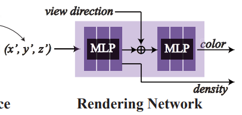
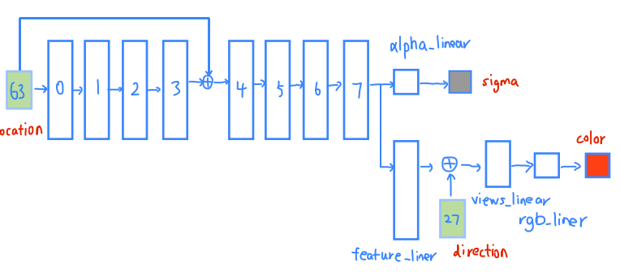

- [1. load\_blender.py](#1-load_blenderpy)
- [2. run\_nerf.py](#2-run_nerfpy)
- [3. run\_nerf\_helpers.py](#3-run_nerf_helperspy)
- [4. run\_nerf.py](#4-run_nerfpy)
    - [4.0.1. MLP](#401-mlp)
  - [4.1. train](#41-train)
  - [4.2. render](#42-render)
- [5. 问题](#5-问题)
---

# 1. load_blender.py


`load_blender_data()`

```json
{
    "camera_angle_x": 0.6911112070083618,
    "frames": [
        {
            "file_path": "./train/r_0",
            "rotation": 0.012566370614359171,
            "transform_matrix": [
                [
                    -0.9250140190124512,
                    0.2748899757862091,
                    -0.2622683644294739,
                    -1.0572376251220703
                ],
                [
                    -0.3799331784248352,
                    -0.6692678928375244,
                    0.6385383605957031,
                    2.5740303993225098
                ],
                [
                    0.0,
                    0.6903012990951538,
                    0.7235219478607178,
                    2.9166102409362793
                ],
                [
                    0.0,
                    0.0,
                    0.0,
                    1.0
                ]
            ]
        },
```
- `camera_angle_x`: 算内参的焦距 focal 时用到的FOV
- `rotation`: 没用到。
- `transform_matrix`: 外参之c2w。`load_blender_data`返回的`poses`, `get_rays`的`c2w`。

```python
# 根据此划分
splits = ['train', 'val', 'test']
# 划分下标
# [ [ 0,  1, ..., 99], [100, 101, ..., 112], [113, 114, ..., 137] ]
i_split = [np.arange(counts[i], counts[i+1]) for i in range(3)]
# run_nerf中
i_train, i_val, i_test = i_split


# (138, 800, 800, 4) (index, H, W, C), C是RGBA
imgs = np.concatenate(all_imgs, 0)
# (138, 4, 4), json中的transform_matrix，外参T
poses = np.concatenate(all_poses, 0)


# scalar, 1111.1110311937682
focal = .5 * W / np.tan(.5 * camera_angle_x)

# (40, 4, 4)
render_poses = torch.stack([pose_spherical(angle, -30.0, 4.0) for angle in np.linspace(-180,180,40+1)[:-1]], 0)
```
# 2. run_nerf.py

`train()`

[alpha blending](https://zhuanlan.zhihu.com/p/613427468)
```python
if args.white_bkgd:
    images = images[...,:3]*images[...,-1:] + (1.-images[...,-1:])
else:
    images = images[...,:3]
```

```python
if K is None:
    K = np.array([
        [focal, 0, 0.5*W],
        [0, focal, 0.5*H],
        [0, 0, 1]
    ])
```


# 3. run_nerf_helpers.py

```python
class NeRF(nn.Module):
    def __init__(self, 
        D=8,                    # 默认8层MLP，对应 args.netdepth 和 args.netdepth_fine
        W=256,                  # 默认每层256，对应 args.netwidth 和 args.netwidth_fine
        input_ch=3,             # x,y,z
        input_ch_views=3,       # direction的三维表示
        output_ch=4,            # rgb和sigma
        skips=[4],              # 残差
        use_viewdirs=False 
    ):
```

# 4. run_nerf.py
positional encoding的结果还cat了原始输入的低频信号
`create_nerf()`
```python
# 位置编码 location，由3维变成63维度。
embed_fn, input_ch = get_embedder(args.multires, args.i_embed)
# args.multires = 10, sin和cos几次。
# args.i_embed = 0， 默认表示使用编码。
# input_ch = 63， 63 = 1 * 3 + （2 * 10）* 3 = 原本xyz + （sin, cos 10次）* 3维度
    # def get_embedder(multires, i=0):
    #     if i == -1:
    #         return nn.Identity(), 3
        
    #     embed_kwargs = {
    #                 'include_input' : True,       # 表示加入原生的与否，这就是同原版position encoding的不同之处。
    #                 'input_dims' : 3,
    #                 'max_freq_log2' : multires-1, # 9
    #                 'num_freqs' : multires,       # 10, sin和cos几次。
    #                 'log_sampling' : True,        # 决定是1, 2, 4, 8 ,16 还是 1到16等距离采样。
    #                 'periodic_fns' : [torch.sin, torch.cos],
    #     }
        
    #     embedder_obj = Embedder(**embed_kwargs)
    #     embed = lambda x, eo=embedder_obj : eo.embed(x)
    #     return embed, embedder_obj.out_dim

# 位置编码 direction，由3维变成27维度。
embeddirs_fn, input_ch_views = get_embedder(args.multires_views, args.i_embed)
# args.multires_views = 4, sin和cos几次。
# input_ch = 27， 27 = 1 * 3 + （2 * 4）* 3 = 原本diretion的三维度表示 + （sin, cos 4次）* 3维度
```

### 4.0.1. MLP

首先 NeRF 将场景用 MLP 表示，使用坐标 $\boldsymbol{x}$ 推测出密度 $\sigma$ 和中间特征，然后用这个中间特征 $\boldsymbol{e}$ 和视角 $\boldsymbol{d}$ 推测出这个点的颜色 $\boldsymbol{c}$，下面将这两个过程分开写，其实就是 NeRF 中的网络：

$$
\begin{aligned} (\sigma, \boldsymbol{e}) &=\operatorname{MLP}^{(\mathrm{pos})}(\boldsymbol{x}), \\ \boldsymbol{c} &=\operatorname{MLP}^{(\mathrm{rgb})}(\boldsymbol{e}, \boldsymbol{d}) \end{aligned}\\
$$

  


```python
N_importance = 128
# parser.add_argument("--N_importance", type=int, default=0,
#                         help='number of additional fine samples per ray')

# 没什么意义，在NeRF mdoel定义中， output_ch 只在不使用 use_viewdirs 时才作用
output_ch = 5 if args.N_importance > 0 else 4


skips = [4] # 取默认值

### model是粗模型，model_fine是精细模型
model = NeRF(D=args.netdepth, W=args.netwidth,
                input_ch=input_ch, output_ch=output_ch, skips=skips,
                input_ch_views=input_ch_views, use_viewdirs=args.use_viewdirs).to(device)

if args.N_importance > 0:
    model_fine = NeRF(D=args.netdepth_fine, W=args.netwidth_fine,
                        input_ch=input_ch, output_ch=output_ch, skips=skips,
                        input_ch_views=input_ch_views, use_viewdirs=args.use_viewdirs).to(device)
```
  

```python
# Model
class NeRF(nn.Module):
    def __init__(self, D=8, W=256, input_ch=3, input_ch_views=3, output_ch=4, skips=[4], use_viewdirs=False):
        """ 
        """
        super(NeRF, self).__init__()
        self.D = D
        self.W = W
        self.input_ch = input_ch
        self.input_ch_views = input_ch_views
        self.skips = skips
        self.use_viewdirs = use_viewdirs
        
        self.pts_linears = nn.ModuleList(
            [nn.Linear(input_ch, W)] + [nn.Linear(W, W) if i not in self.skips else nn.Linear(W + input_ch, W) for i in range(D-1)])
        
        ### Implementation according to the official code release (https://github.com/bmild/nerf/blob/master/run_nerf_helpers.py#L104-L105)
        self.views_linears = nn.ModuleList([nn.Linear(input_ch_views + W, W//2)])

        ### Implementation according to the paper
        # self.views_linears = nn.ModuleList(
        #     [nn.Linear(input_ch_views + W, W//2)] + [nn.Linear(W//2, W//2) for i in range(D//2)])
        
        if use_viewdirs:
            self.feature_linear = nn.Linear(W, W)
            self.alpha_linear = nn.Linear(W, 1)
            self.rgb_linear = nn.Linear(W//2, 3)
        else:
            self.output_linear = nn.Linear(W, output_ch)

    def forward(self, x):
        input_pts, input_views = torch.split(x, [self.input_ch, self.input_ch_views], dim=-1)
        h = input_pts
        for i, l in enumerate(self.pts_linears):
            h = self.pts_linears[i](h)
            h = F.relu(h)
            if i in self.skips:
                h = torch.cat([input_pts, h], -1)

        if self.use_viewdirs:
            alpha = self.alpha_linear(h)
            feature = self.feature_linear(h)
            h = torch.cat([feature, input_views], -1)
        
            for i, l in enumerate(self.views_linears):
                h = self.views_linears[i](h)
                h = F.relu(h)

            rgb = self.rgb_linear(h)
            outputs = torch.cat([rgb, alpha], -1)
        else:
            outputs = self.output_linear(h)

        return outputs    
```

The final activations in generating σ(t) and c(t) are a ReLU and a sigmoid respectively, as density must be non-negative and color must be in [0, 1].

## 4.1. train

```python

    parser.add_argument("--N_rand", type=int, default=32*32*4, 
                        help='batch size (number of random rays per gradient step)')
```


## 4.2. render

> 推导：连续积分中 $\sigma$在离散求和之后变成了 $1-\exp(\sigma)$

【连续形式】

$C(\bold{r})=    \int^{t_f}_{t_n}{T(t)σ(\bold{r}(t))\bold{c}(\bold{r}(t),\bold{d})}{\rm d}t$ 

其中

$T(t) = \rm{exp} \left( -\int^{t}_{t_n} {σ(\bold{r}(s))}{\rm d}s \right)$


【离散形式】

计算机求解积分式的办法一般是化为黎曼和。在这里，如果我们每次都将积分区间划分为固定的、等间距的窄长方形面积和，其实就失去了NeRF是**连续**场景表示的优势：因为虽然每个点的RGBσ都可以访问，但是实际上你还是只用了固定点的值求积分。

所以NeRF要用分层采样，把积分区间先划分为等间距多个小区间，然后在每个小区间以均匀分布的概率分布随机采样，以随机采样的点的RGBσ值代表小区间的值，而不是每次都固定用小区间的端点或中点。用公式来表达：积分区间是 $[t_n,t_f]$ ，把他们划分为 $N$ 个小区间，那么第 $i$ 个小区间是 $\left[t_n+\frac{i−1}{N} (t_f−t_n), t_n+\frac{i}{N} (t_f−t_n)\right]$ ；那么，第 $i$ 个小区间随机采样的点 $t_i$ 服从该小区间上的均匀分布

$$t_i \sim \mathcal{U}  \left[t_n+\frac{i−1}{N} (t_f−t_n), t_n+\frac{i}{N} (t_f−t_n)\right] ,  i=1,2,\cdots,N$$

所以， 积分式的离散形式数值估计是

$$C(\bold{r}) = \sum_{i=1}^{N}{C(\bold{r}) }_i =  \sum_{i=1}^{N}  \int^{t_{i+1}}_{t_i}{T(t)σ(\bold{r}(t))\bold{c}(\bold{r}(t),\bold{d})}{\rm d}t$$

其中，每个小区间的积分估计是 $C(\bold{r}) _i$ 是

$$\begin{align} C(\bold{r})_i &=   \int^{t_{i+1}}_{t_i}{T(t)σ(\bold{r}(t))\bold{c}(\bold{r}(t),\bold{d})}{\rm d}t 
\\ &=  \int^{t_{i+1}}_{t_i}{ {\rm exp} \left( -\int^{t}_{t_n} {σ(s)}{\rm d}s \right)  σ_i \bold{c}_i }{\rm d}t  \end{align}$$

被积函数的三项， $σ(\bold{r}(t))$ 可以被直接近似为常数 $\sigma_i$ ,可由多层感知机的输出直接给出； $\bold{c}(\bold{r}(t),\bold{d})$ 也被直接近似为常数 $\bold{c}_i$ ，也可由多层感知机的输出直接给出。但是 $T(t)$ 属于嵌套积分，它的值在小区间 $[t_i,t_{i+1}]$ 随积分变量 $t$ 的变化不可忽略，故暂且不能视为常数。

$$\begin{align} C(\bold{r})_i &= σ_i \bold{c}_i  \int^{t_{i+1}}_{t_i}{ {\rm exp} \left( -\int^{t}_{t_n} {σ(s)}{\rm d}s \right)  }{\rm d}t 
\\ &= σ_i \bold{c}_i  \int^{t_{i+1}}_{t_i}{ {\rm exp} \left( -\int^{t_i}_{t_n} {σ(s)}{\rm d}s \right) {\rm exp} \left( -\int^{t}_{t_i} {σ(s)}{\rm d}s \right)  }{\rm d}t 
\\ &= σ_i \bold{c}_i T_i \int^{t_{i+1}}_{t_i}{ {\rm exp} \left( -\int^{t}_{t_i} {σ(s)}{\rm d}s \right)  }{\rm d}t \\ \end{align}$$

将$T(t)$ 拆为两段后，前一段积分 ${\rm exp} \left( -\int^{t_i}_{t_n} {σ(s)} \right){\rm d}s$ 中没有变量，故可近似为$T_i$ ，后一段直接求解 ${\rm exp} \left ( -\int^{t}_{t_i} {σ(s)}\right){\rm d}s={\rm exp}(-\sigma_i(t-t_i))$ 。所以

$$\begin{align} C(\bold{r})_i  &= σ_i \bold{c}_i T_i \cdot \int^{t_{i+1}}_{t_i}{ {\rm exp}(-\sigma_i(t-t_i)) } {\rm d}t 
\\ &=σ_i \bold{c}_i T_i \cdot \frac{e^{-\sigma_i(t-t_i)}}{-\sigma_i} \vert_{t_i}^{t_{i+1}} 
\\ &= \bold{c}_i T_i (1-e^{-σ_i\delta_i}) \end{align}$$

其中 $\delta_i=t_{i}-t_{i-1}$ 记为小区间的长度。

大功告成，体积渲染积分的离散形式推导完成。

$$C(\bold{r}) = \sum_{i=1}^{N} \bold{c}_i T_i (1-e^{-σ_i\delta_i}) , \  T_i = {\rm exp}\left( -\sum_{j=1}^{i-1} σ_i\delta_i \right).$$

  


> 原文：

we typically use quadrature to approximate the integrals, where $\sigma$ and $c_i$ are assumed to be **piecewise-constant** within a set of N intervals ${[t_{i−1},t_i)}^N_{i=1}$ that partition the length of the ray

$\sigma_i$表示光线上某处点的密度，$T_i$表示前面粒子的遮挡下的透射率。

$$
\begin{aligned} 
\hat{C}(\boldsymbol{r}) &=\sum_{i=1}^N T_i (1-\exp(-\sigma_i\delta_i)) \boldsymbol{c}_i, 
\\ T_i &=\exp{\left(-\sum_{j=1}^{i-1}{\sigma_j\delta_j} \right)},
\\ \operatorname{where} \delta_i &= t_{i} - t_{i-1}
\end{aligned}
$$

> 转化成不透明度的角度就好理解了

$\alpha$表示不透明度，$T_i$透射率就是前面粒子的不透明率的残余相乘，或者说透明度透过的光线相乘，很直观地符合图像里的Alpha Blending。

$$
\begin{aligned} 
\hat{C}(\boldsymbol{r}) &=\sum_{i=1}^N T_i \alpha_i \boldsymbol{c}_i, 
\\ \alpha_i &=\operatorname{alpha}\left(\sigma_i, \delta_i\right)=1-\exp \left(-\sigma_i \delta_i\right), 
\\ T_i &=\prod_{j=1}^{i-1}\left(1-\alpha_j\right) 
\\ \operatorname{where} \delta_i &= t_{i} - t_{i-1}
\end{aligned}
$$

  


  


```python
def render(H, W, K, chunk=1024*32, rays=None, c2w=None, ndc=True,
                  near=0., far=1.,
                  use_viewdirs=False, c2w_staticcam=None,
                  **kwargs):
rgb, disp, acc, extras = render(H, W, K, chunk=args.chunk, rays=batch_rays,
                                                verbose=i < 10, retraw=True,
                                                **render_kwargs_train)
```

# 5. 问题

图像上一个点对应一条光线还是多条光线的平均？也就是说，图像像素个数和光线个数一致吗？
好像是的。为了渲染一幅1920x1280的图片，需要1920x1280条光线，每条光线(128+64)个粗和线的采样，即MLP需要做1920x1280x(128+64)查询。


以一个像素点 $P(u,v)$为例讲解：从该点发出的射线在世界坐标系中的表示为： $R^{-1}*K^{-1}(u,v,1)^{T}$， c2w = (R, t)


这个rendered image就是在image plane上。