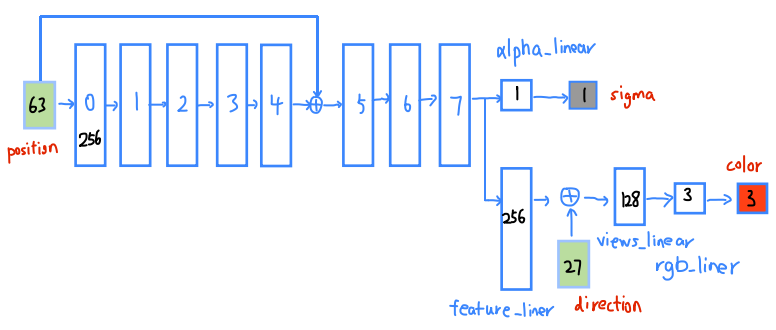

- [NeRF model](#nerf-model)
---


# NeRF model


首先 NeRF 将场景用 MLP 表示，使用坐标 $\boldsymbol{x}$ 推测出密度 $\sigma$ 和中间特征，然后用这个中间特征 $\boldsymbol{e}$ 和视角 $\boldsymbol{d}$ 推测出这个点的颜色 $\boldsymbol{c}$，下面将这两个过程分开写，其实就是 NeRF 中的网络：

$$
\begin{aligned} (\sigma, \boldsymbol{e}) &=\operatorname{MLP}^{(\mathrm{pos})}(\boldsymbol{x}), \\ \boldsymbol{c} &=\operatorname{MLP}^{(\mathrm{rgb})}(\boldsymbol{e}, \boldsymbol{d}) \end{aligned}\\
$$

  

MLP的架构，使得体积密度仅被预测为 **3D 位置**的函数，而发射的辐射率被预测为 **3D 位置和 2D 观察方向**的函数。

MLP 可以被认为是为每个输入的 3D 位置预测一个 256 维的**特征向量**，然后将其与观察方向连接起来并解码为**RGB 颜色**。


  


The final activations in generating σ(t) and c(t) are a **ReLU** and a **sigmoid** respectively, as density must be non-negative and color must be in [0, 1]. (激活函数没有写在模型中，而是写在了积分公式处)

```python
class NeRF(nn.Module):
    def __init__(self, 
        D=8,                    # 默认8层MLP，对应 args.netdepth 和 args.netdepth_fine
        W=256,                  # 默认每层256，对应 args.netwidth 和 args.netwidth_fine
        input_ch=3,             # x,y,z
        input_ch_views=3,       # direction的三维表示
        output_ch=4,            # rgb和sigma
        skips=[4],              # 残差
        use_viewdirs=False 
    ):
```

`output_ch = 5 if args.N_importance > 0 else 4` 只在不使用方向时`use_viewdirs=False`有效果，正常使用方向时就是4.
