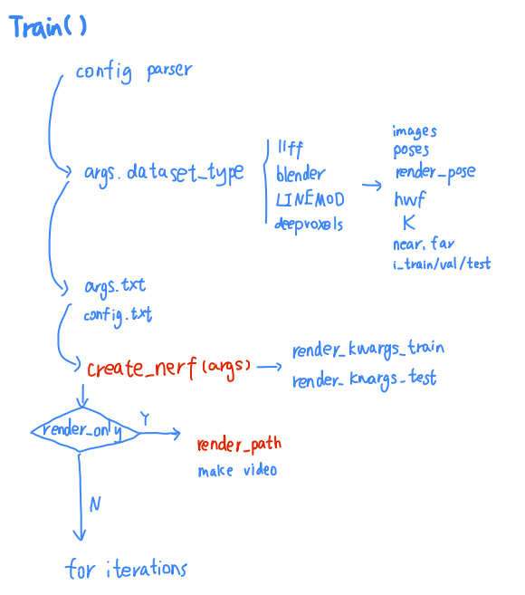

## First Impression

根据给定一个场景的若干张图片，重构出这个场景的3D表示，然后推理的时候输入不同视角就可以合成（渲染）这个视角下的图像了。

可以理解为把一个空间朝一个方向上拍扁，空间中的颜色加权求和得到平面上的颜色。

如果表示一点处不同方向的颜色？方向有无数个，那么要存储无穷个方向的颜色吗？答案是，球谐函数，用来表示同一位置处不同方向的颜色。
[球谐函数介绍（Spherical Harmonics）](https://zhuanlan.zhihu.com/p/351289217)

## Parts

1. [configs](./configs.md)
2. load data
   [blender](./blender.md)
   [llff](./llff.md)
   [rays](./rays.md)
3. [model](./model.md)
4. [render](./render.md)

  

> args.txt, config.txt

`args.txt` 会保存所有的参数，包括临时指定的命令行参数。

`config.txt` 只会当传入 `--configs xxx.txt` 时才会保存， 且只保存原本的 `xxx.txt` 的配置（相当于复制一份）， 不包括被临时指定的命令行参数指定的参数。

## Reference

[体积云渲染实战：ray marching，体积云与体积云光照](https://blog.csdn.net/weixin_44176696/article/details/113090350)

[NeRF 源码分析解读（一）](https://blog.csdn.net/qq_41071191/article/details/125440451)

[华为云开发者联盟 -【NeRF】深度解读yenchenlin/nerf-pytorch项目](https://huaweicloud.csdn.net/63806ddedacf622b8df88375.html)

[NeRF代码解读-相机参数与坐标系变换](https://zhuanlan.zhihu.com/p/593204605)

[NeRF论文复现](https://enigmatisms.github.io/2022/03/27/NeRF%E8%AE%BA%E6%96%87%E5%A4%8D%E7%8E%B0/)

[Scratchapixel 3.0](https://www.scratchapixel.com/index.html)

[NeRF神经辐射场学习笔记（二）——Pytorch版NeRF实现以及代码注释](https://blog.csdn.net/weixin_44292547/article/details/126249933)