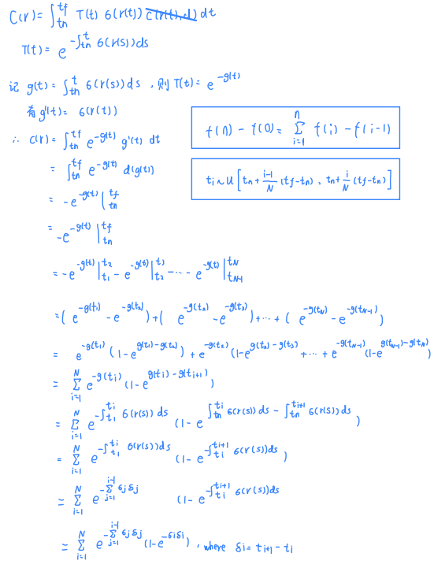
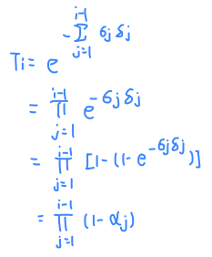
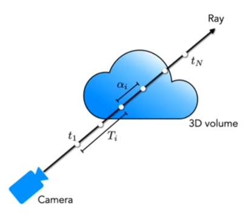
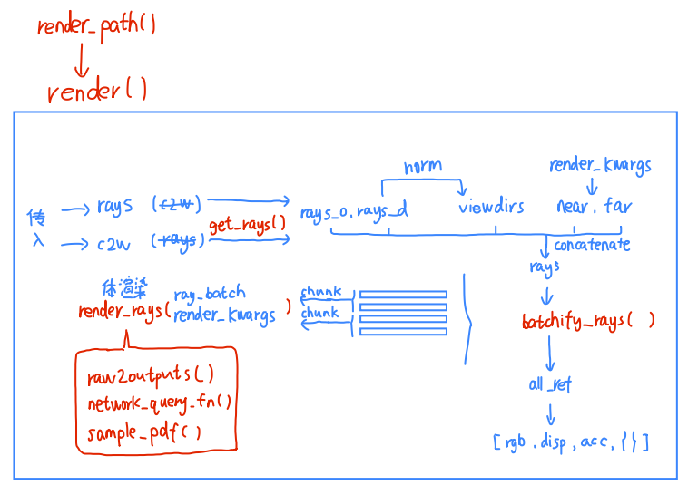
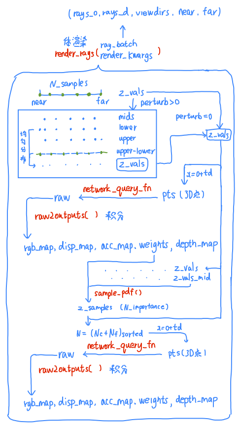
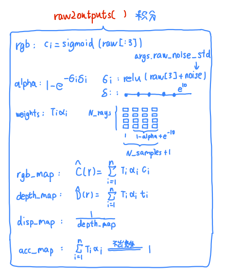

- [1. render](#1-render)
  - [1.1. equations](#11-equations)
  - [1.2. code](#12-code)
    - [1.2.1. render](#121-render)
    - [1.2.3. render\_rays](#123-render_rays)
    - [1.2.2. raw2outputs](#122-raw2outputs)


---
# 1. render
## 1.1. equations

> 推导：连续积分中 $\sigma$在离散求和之后变成了 $1-\exp(\sigma)$

【连续形式】

$$C(\bold{r})=    \int^{t_f}_{t_n}{T(t)σ(\bold{r}(t))\bold{c}(\bold{r}(t),\bold{d})}{\rm d}t$$ 

其中

$$T(t) = \rm{exp} \left( -\int^{t}_{t_n} {σ(\bold{r}(s))}{\rm d}s \right)$$


【离散形式】

计算机求解积分式的办法一般是化为黎曼和。在这里，如果我们每次都将积分区间划分为固定的、等间距的窄长方形面积和，其实就失去了NeRF是**连续**场景表示的优势：因为虽然每个点的RGBσ都可以访问，但是实际上你还是只用了固定点的值求积分。

所以NeRF要用分层采样，把积分区间先划分为等间距多个小区间，然后在每个小区间以均匀分布的概率分布随机采样，以随机采样的点的RGBσ值代表小区间的值，而不是每次都固定用小区间的端点或中点。用公式来表达：积分区间是 $[t_n,t_f]$ ，把他们划分为 $N$ 个小区间，那么第 $i$ 个小区间是 $\left[t_n+\frac{i−1}{N} (t_f−t_n), t_n+\frac{i}{N} (t_f−t_n)\right]$ ；那么，第 $i$ 个小区间随机采样的点 $t_i$ 服从该小区间上的均匀分布

$$t_i \sim \mathcal{U}  \left[t_n+\frac{i−1}{N} (t_f−t_n), t_n+\frac{i}{N} (t_f−t_n)\right] ,  i=1,2,\cdots,N$$

所以， 积分式的离散形式数值估计是

$$C(\bold{r}) = \sum_{i=1}^{N}{C(\bold{r}) }_i =  \sum_{i=1}^{N}  \int^{t_{i+1}}_{t_i}{T(t)σ(\bold{r}(t))\bold{c}(\bold{r}(t),\bold{d})}{\rm d}t$$

其中，每个小区间的积分估计是 $C(\bold{r}) _i$ 是

$$\begin{align} C(\bold{r})_i &=   \int^{t_{i+1}}_{t_i}{T(t)σ(\bold{r}(t))\bold{c}(\bold{r}(t),\bold{d})}{\rm d}t 
\\ &=  \int^{t_{i+1}}_{t_i}{ {\rm exp} \left( -\int^{t}_{t_n} {σ(s)}{\rm d}s \right)  σ_i \bold{c}_i }{\rm d}t  \end{align}$$

被积函数的三项， $σ(\bold{r}(t))$ 可以被直接近似为常数 $\sigma_i$ ,可由多层感知机的输出直接给出； $\bold{c}(\bold{r}(t),\bold{d})$ 也被直接近似为常数 $\bold{c}_i$ ，也可由多层感知机的输出直接给出。但是 $T(t)$ 属于嵌套积分，它的值在小区间 $[t_i,t_{i+1}]$ 随积分变量 $t$ 的变化不可忽略，故暂且不能视为常数。

$$\begin{align} C(\bold{r})_i &= σ_i \bold{c}_i  \int^{t_{i+1}}_{t_i}{ {\rm exp} \left( -\int^{t}_{t_n} {σ(s)}{\rm d}s \right)  }{\rm d}t 
\\ &= σ_i \bold{c}_i  \int^{t_{i+1}}_{t_i}{ {\rm exp} \left( -\int^{t_i}_{t_n} {σ(s)}{\rm d}s \right) {\rm exp} \left( -\int^{t}_{t_i} {σ(s)}{\rm d}s \right)  }{\rm d}t 
\\ &= σ_i \bold{c}_i T_i \int^{t_{i+1}}_{t_i}{ {\rm exp} \left( -\int^{t}_{t_i} {σ(s)}{\rm d}s \right)  }{\rm d}t \\ \end{align}$$

将$T(t)$ 拆为两段后，前一段积分 ${\rm exp} \left( -\int^{t_i}_{t_n} {σ(s)} \right){\rm d}s$ 中没有变量，故可近似为$T_i$ ，后一段直接求解 ${\rm exp} \left ( -\int^{t}_{t_i} {σ(s)}\right){\rm d}s={\rm exp}(-\sigma_i(t-t_i))$ 。所以

$$\begin{align} C(\bold{r})_i  &= σ_i \bold{c}_i T_i \cdot \int^{t_{i+1}}_{t_i}{ {\rm exp}(-\sigma_i(t-t_i)) } {\rm d}t 
\\ &=σ_i \bold{c}_i T_i \cdot \frac{e^{-\sigma_i(t-t_i)}}{-\sigma_i} \vert_{t_i}^{t_{i+1}} 
\\ &= \bold{c}_i T_i (1-e^{-σ_i\delta_i}) \end{align}$$

其中 $\delta_i=t_{i}-t_{i-1}$ 记为小区间的长度。

大功告成，体积渲染积分的离散形式推导完成。

$$C(\bold{r}) = \sum_{i=1}^{N} \bold{c}_i T_i (1-e^{-σ_i\delta_i}) , \  T_i = {\rm exp}\left( -\sum_{j=1}^{i-1} σ_i\delta_i \right).$$

  


> 原文：

we typically use quadrature to approximate the integrals, where $\sigma$ and $c_i$ are assumed to be **piecewise-constant** within a set of N intervals ${[t_{i−1},t_i)}^N_{i=1}$ that partition the length of the ray

$\sigma_i$表示光线上某处点的密度，$T_i$表示前面粒子的遮挡下的透射率。

$$
\begin{aligned} 
\hat{C}(\boldsymbol{r}) &=\sum_{i=1}^N T_i (1-\exp(-\sigma_i\delta_i)) \boldsymbol{c}_i, 
\\ T_i &=\exp{\left(-\sum_{j=1}^{i-1}{\sigma_j\delta_j} \right)},
\\ \operatorname{where} \delta_i &= t_{i+1} - t_{i}
\end{aligned}
$$

> 转化成不透明度的角度就好理解了

$\alpha$表示不透明度，$T_i$透射率就是前面粒子的透明度相乘，留给后面粒子的可见程度，很直观地符合图像里的Alpha Blending。

$$
\begin{aligned} 
\hat{C}(\boldsymbol{r}) &=\sum_{i=1}^N T_i \alpha_i \boldsymbol{c}_i, 
\\ \alpha_i &=\operatorname{alpha}\left(\sigma_i, \delta_i\right)=1-\exp \left(-\sigma_i \delta_i\right), 
\\ T_i &=\prod_{j=1}^{i-1}\left(1-\alpha_j\right) 
\\ \operatorname{where} \delta_i &= t_{i+1} - t_{i}
\end{aligned}
\\ \text{特殊点}, T_1 = 1, \delta_n 取 e^{10}
$$

  





## 1.2. code

### 1.2.1. render

  

### 1.2.3. render_rays

  


`render_kwargs_test` 会去除随机性。
```python
render_kwargs_test['perturb'] = False
render_kwargs_test['raw_noise_std'] = 0.
```


`sample_pdf()`: 逆采样 

### 1.2.2. raw2outputs

  