- [1. 物像关系](#1-物像关系)
- [2. FOV](#2-fov)
- [3. 相机坐标](#3-相机坐标)
- [4. 坐标系](#4-坐标系)

---
## 1. 物像关系

$\dfrac{1}{f} = \dfrac{1}{d_1} + \dfrac{1}{d_2}$

f为焦距，d1为物距（物体到透镜的距离），d2为像距（透镜到像面的距离）。

[由此可以推出不同的成像关系](https://www.zhihu.com/question/38929736/answer/2327108553)

## 2. FOV
视场角，即Field of view（FOV）。焦距越短，FOV越大；焦距越长，FOV越小。

公式就是tan三角函数联系起焦距与高宽、或物距与物高宽。

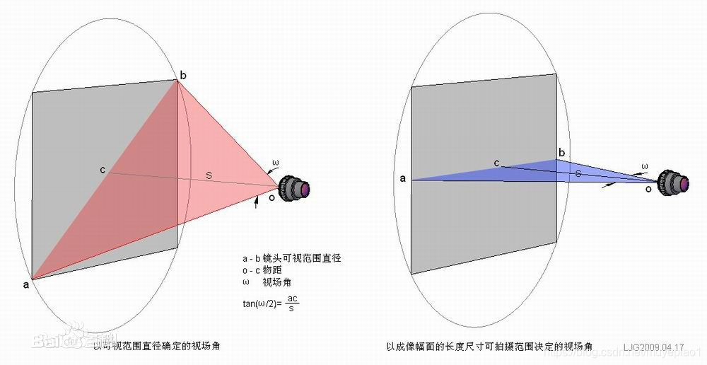  


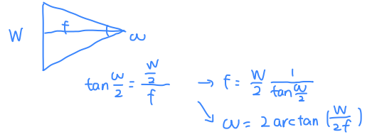  

  W是图像的宽度，$\omega$是x轴的视角宽度，f是焦距。
```python
# `camera_angle_x`即在x轴的视角，对应图像的宽度。
focal = .5 * W / np.tan(.5 * camera_angle_x)

```
`"camera_angle_x": 0.5235987755982988,` 就是比如30°， Π/6 = 0.5235987755982988

`W`的单位是pixel， f的单位也是pixel。

## 3. 相机坐标

相机两个参数：内参和外参
- 内参intrinsics，即**K**
    固定不变的，如果不知道可以通过**标定**求得。
- 外参extrinsics，即**T**
    描述相机的位姿，即变换矩阵（Transform Matrix），由旋转R和平移t组成。
- 内参共有，外参变化：
    由于多组图片都是同一个相机拍摄得到，所以其内参数由多组图像共有，而外参数随着不同的图像将发生变化
- 都用齐次坐标表示
  

内参：

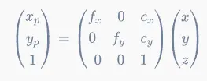  
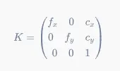  
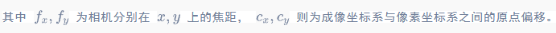  

```python
# 平移到图像中心
K = np.array([
    [focal, 0, 0.5*W],
    [0, focal, 0.5*H],
    [0, 0, 1]
])
```

外参：
相机外参是一个4x4的矩阵$T$，其作用是将世界坐标系的点$P_{world}=[x,y,z,1]$变换到相机坐标系下$P_{camera}=TP_{world}$。我们也把相机外参叫做**world-to-camera (w2c)矩阵**。相机外参的逆矩阵被称为**camera-to-world (c2w)矩阵**。其作用是把相机坐标系的点变换到世界坐标系。

NeRF主要使用c2w，这里详细介绍一下c2w的含义。c2w矩阵是一个4x4的矩阵，左上角3x3是旋转矩阵R，又上角的3x1向量是平移向量T。有时写的时候可以忽略最后一行[0,0,0,1]。


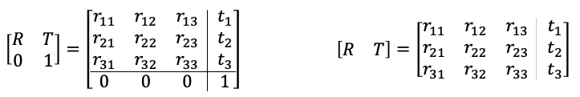  


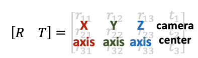  
旋转矩阵的第一列到第三列分别表示了相机坐标系的X, Y, Z轴在世界坐标系下对应的方向；平移向量表示的是相机原点在世界坐标系的对应位置。

## 4. 坐标系

世界坐标系，相机坐标系，像素坐标系


> ABC对应XYZ

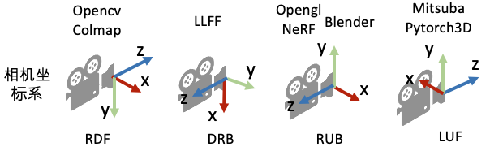  


  

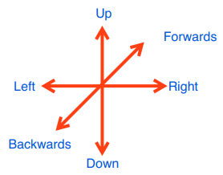  


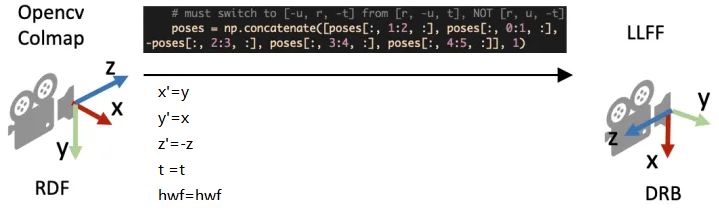  
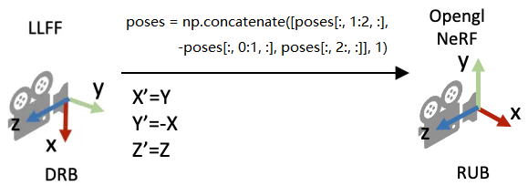  
