- [1. 物像关系](#1-物像关系)
- [2. FOV](#2-fov)
- [3. 相机参数](#3-相机参数)
  - [3.1. 内参](#31-内参)
  - [3.2. 外参](#32-外参)
- [4. 坐标系](#4-坐标系)
  - [4.1. 右手坐标系 right-handed coordinates](#41-右手坐标系-right-handed-coordinates)
  - [4.2. 相机坐标系](#42-相机坐标系)
- [5. Frame Transforms](#5-frame-transforms)
  - [5.1. 世界坐标系\<-\>相机坐标系](#51-世界坐标系-相机坐标系)
  - [5.2. 透射](#52-透射)
    - [5.2.1. 相机坐标系\<-\>图像坐标系](#521-相机坐标系-图像坐标系)
    - [5.2.2. 图像坐标系\<-\>像素坐标系](#522-图像坐标系-像素坐标系)
  - [5.3. 综合](#53-综合)
- [反向](#反向)

---
## 1. 物像关系

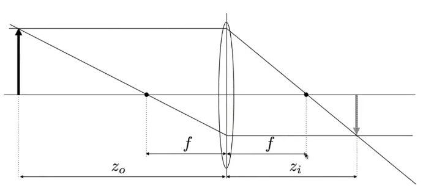  

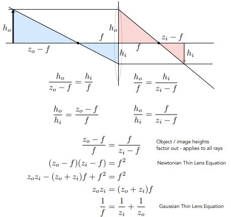  


$\dfrac{1}{f} = \dfrac{1}{z_0} + \dfrac{1}{z_i}$

f为焦距， $z_0$为物距（物体到透镜的距离）， $z_i$为像距（透镜到像面的距离）。


[由此可以推出不同的成像关系](https://www.zhihu.com/question/38929736/answer/2327108553)

## 2. FOV
视场 Field of view（FOV），是一个角度。

> 当传感器大小固定时，焦距越短，FOV越大；焦距越长，FOV越小。

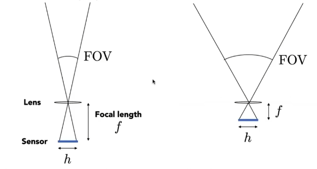

> 当焦距固定时，传感器大小越小，FOV越小。

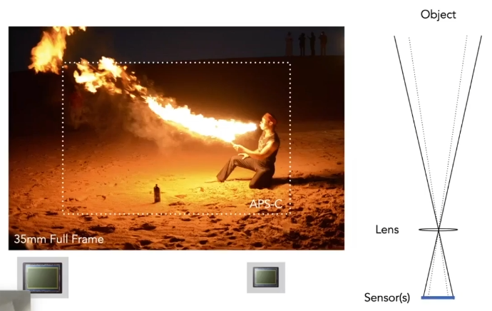  


> 公式就是tan三角函数联系起焦距与高宽、或物距与物高宽。

  


  

W是图像的宽度（传感器大小），$\omega$是x轴的视角宽度，f是焦距。
```python
# `camera_angle_x`即在x轴的视角，对应图像的宽度。
focal = .5 * W / np.tan(.5 * camera_angle_x)
```
`"camera_angle_x": 0.5235987755982988,` 就是比如30°， Π/6 = 0.5235987755982988

`W`的单位是pixel， f的单位也是pixel。


> 镜头参数

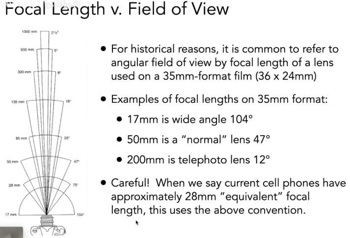  

我们以35mm-format的底片大小为标准，17mm、50mm、200mm、28mm的焦距是在这样大小的底片上，这个焦距是等效的虚指。意思是，实际手机镜头的焦距很小，对应的也是很小的底片大小。

拍照的效果就是，视场越窄，镜头拍到的就越远。

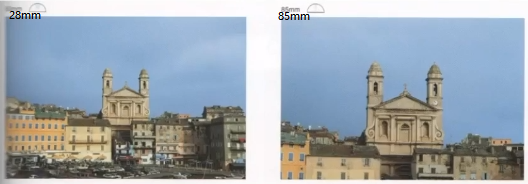  

> maintain same FOV

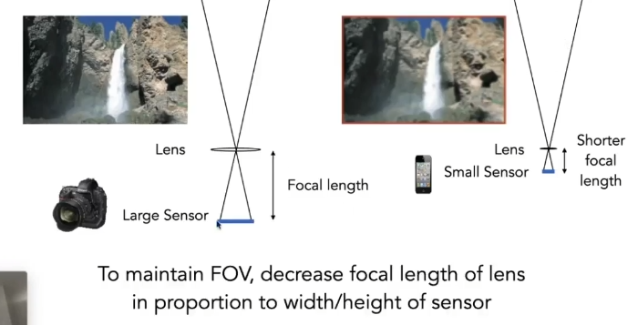  


## 3. 相机参数

相机两个参数：内参和外参

- 外参extrinsics，即**M**
    描述相机的位姿（位置t是指相机在空间中的哪个地方，而姿态R则是指相机的朝向）

- 内参intrinsics，即**K**
    固定不变的，如果不知道可以通过**标定**求得。

- 内参共有，外参变化：
    由于多组图片都是同一个相机拍摄得到，所以其内参数由多组图像共有，而外参数随着不同的图像将发生变化
- 都用齐次坐标表示
  

### 3.1. 内参

透射：The intrinsic matrix transforms 3D camera cooordinates to 2D homogeneous image coordinates.

$K = \begin{bmatrix} \alpha f_x & s & c_x\\ 0 & \beta f_y & c_y\\ 0 & 0 & 1\end{bmatrix}$

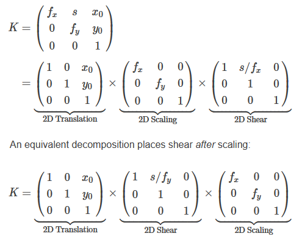  

平移操作放在最后（即最左）。

在内参矩阵中还有个参数 $s$（通常也可当成0），用来建模像素是平行四边形而不是矩形，与像素坐标系的u，v轴之间的夹角$\theta$的正切值$tan(\theta)$成反比，因此当 $s = 0$时，表示像素为矩形。

```python
# 缩放尺寸为1，不缩放
# 平移到图像中心
K = np.array([
    [focal, 0, 0.5*W],
    [0, focal, 0.5*H],
    [0, 0, 1]
])
```

### 3.2. 外参

> 相机外参是一个4x4的矩阵M。

相机外参叫做**world-to-camera (w2c)矩阵**，其作用是把3D世界坐标系的坐标变换到2D相机坐标系的坐标。

相机外参的逆矩阵被称为**camera-to-world (c2w)矩阵**，其作用是把2D相机坐标系的坐标变换到3D世界坐标系的坐标。

> **NeRF主要使用c2w**

c2w的含义: camera's pose matrix

c2w矩阵是一个4x4的矩阵，左上角3x3是旋转矩阵R，又上角的3x1向量是平移向量T。有时写的时候可以忽略最后一行[0,0,0,1]。

  
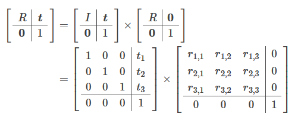  

- R
    $R \in SO(3)$
    $SO(n) = \{R \in \R^{n\times n}|RR^T=I,det(R)=1\}$
    - 旋转矩阵是一个正交矩阵, 正交矩阵的逆等于其转置矩阵。旋转矩阵的逆等于其转置矩阵
    - 行列式值为1

- M
    $M \in SE(3)$
    $SE(n) = \left\{T=\begin{bmatrix}R & t\\ 0^T & 1\end{bmatrix} \in \R^{4\times 4}|R\in SO(3),t\in \R^3\right\}$


 

The camera's extrinsic matrix describes the camera's location in the world, and what direction it's pointing

- 旋转矩阵的每一列分别表示了相机坐标系的XYZ轴方向在世界坐标系下对应的XYZ轴方向。
    R'columns are the directions of the camera-axes in the world coordinates.

- 平移向量表示的是相机原点在世界坐标中的位置。
    The sign of $t_x$, $t_y$, $t_z$ should reflect the position of the camera origin appears in the world coordinates.

> w2c

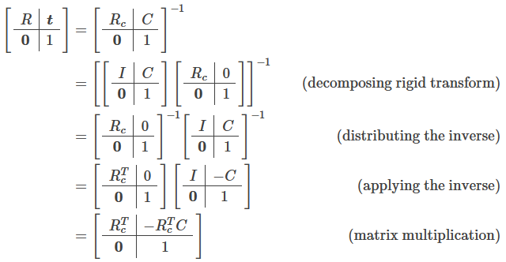  

$\begin{bmatrix} R_c & C \end{bmatrix}$表示camera's pose matrix(c2w)。
所以，w2c 可以通过 c2w 的逆：

$$
\begin{aligned}
R&=R^T_c
\\ t&=-R^T_cC =-RC
\end{aligned}
$$


## 4. 坐标系
坐标系 Coordinate Frames

  

Express motion information relative to a reference frame. 

参考坐标系 reference frame可以分为：
- Camera Frame
- World Frame

之后的图像坐标系和像素坐标系只有xy轴，且和相机坐标系的xy轴方向保持一致。
### 4.1. 右手坐标系 right-handed coordinates

手掌：用右手的**4个指头从a转向b**（合拳，而不是松拳），大拇指朝向就是aXb的方向。

三指：右手，大拇指a，食指b，中指的方向就是axb。（是大食中、食中大、中大食的升序，而不是中食大等的降序）

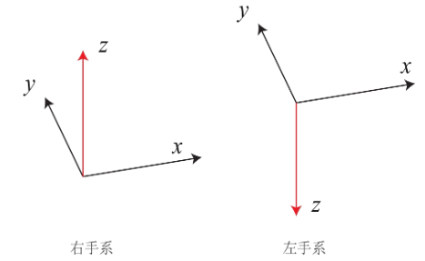  

### 4.2. 相机坐标系

ABC对应XYZ

  


  


  
  

或者
```python
# 补全成4x4的矩阵
# flip the sign of the y-axis (from down to up) and z-axis (from forwards to backwards)
camtoworlds_opengl = camtoworlds_opencv @ np.diag([1, -1, -1, 1])
```

## 5. Frame Transforms


图像的成像过程经历了世界坐标系—>相机坐标系—>图像坐标系—>像素坐标系这四个坐标系的转换，如下图所示：

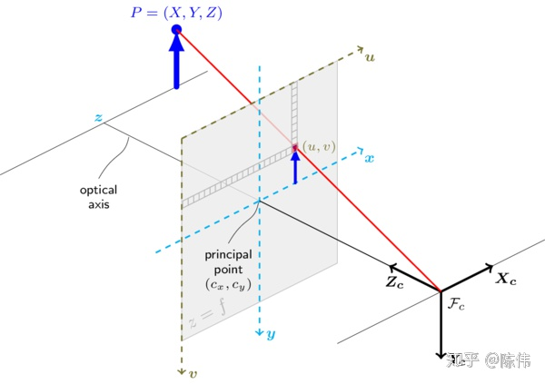  

- 像素坐标系 pixels coordinate：以图像平面左上角为原点的坐标系 ，X 轴和Y 轴分别平行于图像坐标系的 X 轴和Y 轴，用 $(u,v)$ 表示其坐标值。像素坐标系就是以像素为单位的图像坐标系。

- 图像坐标系 image coordinate：以光心在图像平面投影为原点的坐标系 ，X轴和Y 轴分别平行于图像平面的两条垂直边，用 $(x, y)$ 表示其坐标值。图像坐标系是用物理单位表示像素在图像中的位置。

- 相机坐标系 camera coordinate：以相机光心为原点的坐标系，X 轴和Y 轴分别平行于图像坐标系的 X 轴和Y 轴，相机的光轴为Z 轴，用 $(x_{c}, y_{c},z_{c})$ 表示其坐标值。

- 世界坐标系 world coordinate：是三维世界的绝对坐标系，我们需要用它来描述三维环境中的任何物体的位置，用 $(x_{w}, y_{w},z_{w})$ 表示其坐标值。

### 5.1. 世界坐标系<->相机坐标系

属于刚体变换，包括旋转和平移操作，通过六个自由度的外参矩阵反应了物体与相机的相对运动关系


- 世界坐标系的欧式点$P_{w}=[X_{w}, Y_{w}, Z_{w}]$，相机坐标系的欧式点$P_{c}=[X_{c}, Y_{c}, Z_{c}]$，

    $$P_{c}=RP_{w}+t$$

    $$\begin{bmatrix} X_{c} \\ Y_{c} \\ Z_{c}  \end{bmatrix}  
    = R \begin{bmatrix} X_{w} \\  Y_{w} \\ Z_{w}  \end{bmatrix} + \begin{bmatrix} t_{x} \\  t_{y} \\ t_{z}  \end{bmatrix}$$

- 世界坐标系的齐次坐标点$P_{w}=[X_{w}, Y_{w}, Z_{w}, 1]$，相机坐标系的欧式点$P_{c}=[X_{c}, Y_{c}, Z_{c}]$，

    $$P_{c}=\begin{bmatrix} R & T \end{bmatrix}P_{w}$$

    $$\begin{bmatrix} X_{c} \\ Y_{c} \\ Z_{c} \end{bmatrix}  
    = \begin{bmatrix} R & t \end{bmatrix}  \begin{bmatrix} X_{w} \\  Y_{w} \\ Z_{w} \\ 1 \end{bmatrix}$$

- 世界坐标系的齐次坐标点$P_{w}=[X_{w}, Y_{w}, Z_{w}, 1]$，相机坐标系的齐次坐标点$P_{c}=[X_{c}, Y_{c}, Z_{c}, 1]$，

    $$P_{c}=\begin{bmatrix} R & t \\ 0^T & 1 \end{bmatrix}P_{w}$$

    $$\begin{bmatrix} X_{c} \\ Y_{c} \\ Z_{c} \\ 1 \end{bmatrix}  
    = \begin{bmatrix} R & t \\ 0^T & 1  \end{bmatrix}  \begin{bmatrix} X_{w} \\  Y_{w} \\ Z_{w} \\ 1 \end{bmatrix}$$


例子：

$\begin{bmatrix} R & T \end{bmatrix}
\begin{bmatrix} \cos(\theta) \\ -\sin(\theta) \\ -\sin(\theta*zrate) \\ 1 \end{bmatrix}$

### 5.2. 透射

#### 5.2.1. 相机坐标系<->图像坐标系

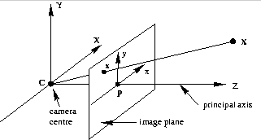  

图像坐标系(对应平面叫做image plane)的x和y轴方向和相机坐标系的保持一致。

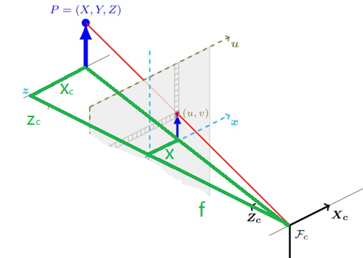  

从3D的相机坐标系下的欧式点 $(X_{c}, Y_{c}, Z_{c})$ 到2D的图像坐标系下的欧式点 $(x,y)$  

The focal length is the distance between the pinhole and image plane. 
$$\begin{aligned}
\dfrac{f}{Z_{c}} &= \dfrac{x}{X_c} = \dfrac{y}{Y_c}
\\ x&=f\dfrac{X_{c}}{Z_{c}}
\\ y&=f\dfrac{Y_{c}}{Z_{c}}\end{aligned}$$

$\begin{bmatrix} f_x & 0 & 0 & 0\\ 0 & f_y & 0 & 0\\ 0 & 0 & 1 & 0\end{bmatrix}  \begin{bmatrix} X_{c} \\  Y_{c} \\ Z_{c} \\ 1 \end{bmatrix}
=\begin{bmatrix} f_xX_c \\ f_yY_c \\ Z_c \end{bmatrix} 
=Z_c\begin{bmatrix} f_x\dfrac{X_{c}}{Z_{c}} \\ f_y\dfrac{Y_{c}}{Z_{c}} \\ 1 \end{bmatrix}
=Z_c\begin{bmatrix}x \\y \\1 \end{bmatrix}$

$\begin{bmatrix} f_x & 0 & 0\\ 0 & f_y & 0\\ 0 & 0 & 1\end{bmatrix}  \begin{bmatrix} X_{c} \\  Y_{c} \\ Z_{c}\end{bmatrix}
=\begin{bmatrix} f_xX_c \\ f_yY_c \\ Z_c \end{bmatrix} 
=Z_c\begin{bmatrix} f_x\dfrac{X_{c}}{Z_{c}} \\ f_y\dfrac{Y_{c}}{Z_{c}} \\ 1 \end{bmatrix}
=Z_c\begin{bmatrix}x \\y \\1 \end{bmatrix}$


PS：倒像问题

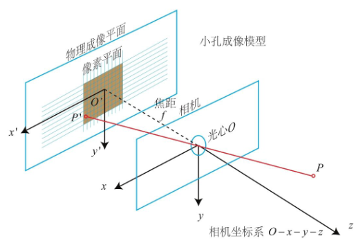  

P点的x是负坐标，P'点的x是正坐标。

$$\dfrac{f}{Z_{c}} = -\dfrac{x}{X_c} = -\dfrac{y}{Y_C}$$

其中负号表示成的像是倒立的。为了简化模型，我们可以把成像平面对称到相机前方，和三维空间点一起放在摄像机坐标系的同一侧，这样做可以把公式中的负号去掉，使式子更加简洁。

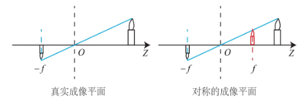  

#### 5.2.2. 图像坐标系<->像素坐标系

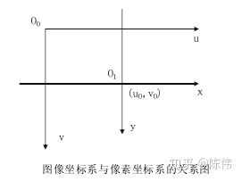  


像素坐标系：以左上角点为原点，u轴向右与x轴平行，v轴向右与y轴平行。像素坐标系和图像坐标系之间，相差了一个缩放 $\alpha, \beta$和原点的平移 $c_x, c_y$。

$$\begin{aligned}
u&=\alpha x + c_x
\\ v&=\beta y + c_y
\end{aligned}$$

$
Z_c \begin{bmatrix}\alpha & 0 & c_x \\0 & \beta & c_y \\ 0 & 0 & 1 \end{bmatrix}\begin{bmatrix}x \\y \\1 \end{bmatrix} = 
Z_c\begin{bmatrix} u \\v \\ 1\end{bmatrix}
$

### 5.3. 综合

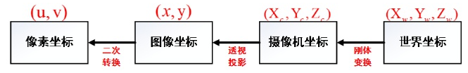 

$ Z_c\begin{bmatrix} u \\ v \\ 1\end{bmatrix} = KMP_w$

- 世界坐标系的欧式点$P_{w}=[X_{w}, Y_{w}, Z_{w}]$，像素坐标的齐次坐标点 $P_{uv}=[u, v]$


    $$\begin{aligned}
    Z_c\begin{bmatrix} u \\ v \\ 1\end{bmatrix} 
    &= \begin{bmatrix} \alpha & 0 & c_x \\0 & \beta & c_y \\ 0 & 0 & 1 \end{bmatrix}
    \begin{bmatrix} f_x & 0 & 0\\ 0 & f_y & 0\\ 0 & 0 & 1\end{bmatrix}
    \begin{bmatrix} R & t\end{bmatrix}  \begin{bmatrix} X_{w} \\  Y_{w} \\ Z_{w} \\ 1 \end{bmatrix}
    \\ &= 
    \begin{bmatrix} \alpha f_x & 0 & c_x\\ 0 & \beta f_y & c_y\\ 0 & 0 & 1\end{bmatrix}
    \begin{bmatrix} R & t\end{bmatrix}  \begin{bmatrix} X_{w} \\  Y_{w} \\ Z_{w} \\ 1 \end{bmatrix}
    \\ &= KMP_w
    \end{aligned}
    $$


- 世界坐标系的齐次坐标点$P_{w}=[X_{w}, Y_{w}, Z_{w}, 1]$，像素坐标的齐次坐标点 $P_{uv}=[u, v]$

    $$\begin{aligned}
    Z_c\begin{bmatrix} u \\ v \\ 1\end{bmatrix} 
    &= \begin{bmatrix} \alpha & 0 & c_x \\0 & \beta & c_y \\ 0 & 0 & 1 \end{bmatrix}
    \begin{bmatrix} f_x & 0 & 0 & 0\\ 0 & f_y & 0 & 0\\ 0 & 0 & 1 & 0\end{bmatrix}
    \begin{bmatrix} R & t \\ 0^T & 1  \end{bmatrix}  \begin{bmatrix} X_{w} \\  Y_{w} \\ Z_{w} \\ 1 \end{bmatrix}
    \\ &= 
    \begin{bmatrix} \alpha f_x & 0 & c_x & 0\\ 0 & \beta f_y & c_y & 0\\ 0 & 0 & 1 & 0\end{bmatrix}
    \begin{bmatrix} R & t \\ 0^T & 1  \end{bmatrix}  \begin{bmatrix} X_{w} \\  Y_{w} \\ Z_{w} \\ 1 \end{bmatrix}
    \\ &= KMP_w
    \end{aligned}
    $$

**相机深度**$z_{c}$ 乘以 **像素坐标**$P_{uv}$ = **相机内参**K 乘以 **相机外参RT** 乘以 **世界坐标**$P_{w}$

像素坐标系下的一点可以被认为是三维空间中的一条射线， $z_{c}$ 就是像素点在相机坐标系下的深度。

## 反向

$d_{u,v} = RK^{−1} \begin{bmatrix} v \\ u \\ 1 \end{bmatrix} + t$