- [summary](#summary)
- [1. homogenous coordinates](#1-homogenous-coordinates)
- [2. 2D transformations](#2-2d-transformations)
- [3. 变化可逆](#3-变化可逆)
- [4. 顺序](#4-顺序)

---

## summary

所以，为什么要用齐次坐标？
- 区分点和向量，点是1，向量是0
- 旋转、倾斜、缩放、翻折等可以用欧式坐标的矩阵乘法，但平移（及包含平移的K透射)需要用齐次坐标的矩阵乘法。

## 1. homogenous coordinates
- Affine map = linear map + translation 
$
\begin{bmatrix} x^{\prime}  \\y^{\prime}\end{bmatrix} = 
\begin{bmatrix}A & B \\C & D\end{bmatrix}
\begin{bmatrix}x \\y\end{bmatrix} +
\begin{bmatrix}t_x \\t_y\end{bmatrix}
$

- use homogenous coordinates
$
\begin{bmatrix} x^{\prime}  \\y^{\prime} \\1 \end{bmatrix} = 
\begin{bmatrix}A & B & t_x \\C & D & t_y \\0 & 0 & 1\end{bmatrix}
\begin{bmatrix}x \\y \\1\end{bmatrix}
$

- $\begin{bmatrix}
x^{\prime} \\
y^{\prime} \\
z^{\prime} \\
1
\end{bmatrix}
=\begin{bmatrix}
a & b & c & t_{x} \\
d & e & f & t_{y} \\
g & h & i & t_{z} \\
0 & 0 & 0 & 1
\end{bmatrix} 
\cdot\begin{bmatrix}
x \\
y \\
z \\
1
\end{bmatrix}$

Add a third coordinate (w-coordinate): 点升维加`1`，向量升维加`0`
- 2D point = $(x, y, 1)^T$
- 2D vector = $(x, y, 0)^T$
- 3D point = $(x, y, z, 1)^T$
- 3D vector = $(x, y, z, 0)^T$

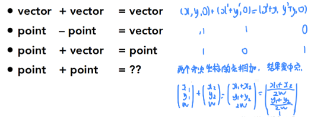  

PS:
- $(x, y, \omega)^T$ is the 2D point $(x/\omega, y/\omega)^T$ $(\omega\neq0)$
- $(x, y, z, \omega)^T$ is the 3D point $(x/\omega, y/\omega, z/\omega)^T$ $(\omega\neq0)$

PS2:

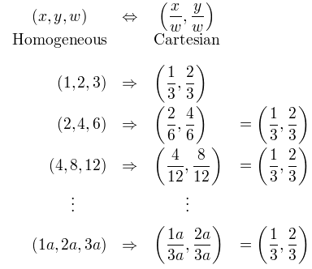  

- 这是错的，表示相同的点不假，但是不是等号啊！
    $\begin{bmatrix} f_xX_c \\ f_yY_c \\ Z_c \end{bmatrix} 
=\begin{bmatrix} f_x\dfrac{X_{c}}{Z_{c}} \\ f_y\dfrac{Y_{c}}{Z_{c}} \\ 1 \end{bmatrix}$
- 这是齐次坐标到欧式坐标
    $\begin{bmatrix} f_xX_c \\ f_yY_c \\ Z_c \end{bmatrix} 
\to \begin{bmatrix} f_x\dfrac{X_{c}}{Z_{c}} \\ f_y\dfrac{Y_{c}}{Z_{c}} \\ 1 \end{bmatrix} \underrightarrow{当\omega=1时，可以直接转化} \begin{bmatrix} f_x\dfrac{X_{c}}{Z_{c}} \\ f_y\dfrac{Y_{c}}{Z_{c}} \end{bmatrix}$
- 这是齐次坐标的矩阵运算
    $\begin{bmatrix} f_xX_c \\ f_yY_c \\ Z_c \end{bmatrix} 
=Z_c\begin{bmatrix} f_x\dfrac{X_{c}}{Z_{c}} \\ f_y\dfrac{Y_{c}}{Z_{c}} \\ 1 \end{bmatrix}$

    $\begin{bmatrix} f_x\dfrac{X_{c}}{Z_{c}} \\ f_y\dfrac{Y_{c}}{Z_{c}} \\ 1 \end{bmatrix}
=\dfrac{1}{Z_c} \begin{bmatrix} f_xX_c \\ f_yY_c \\ Z_c \end{bmatrix} $

## 2. 2D transformations

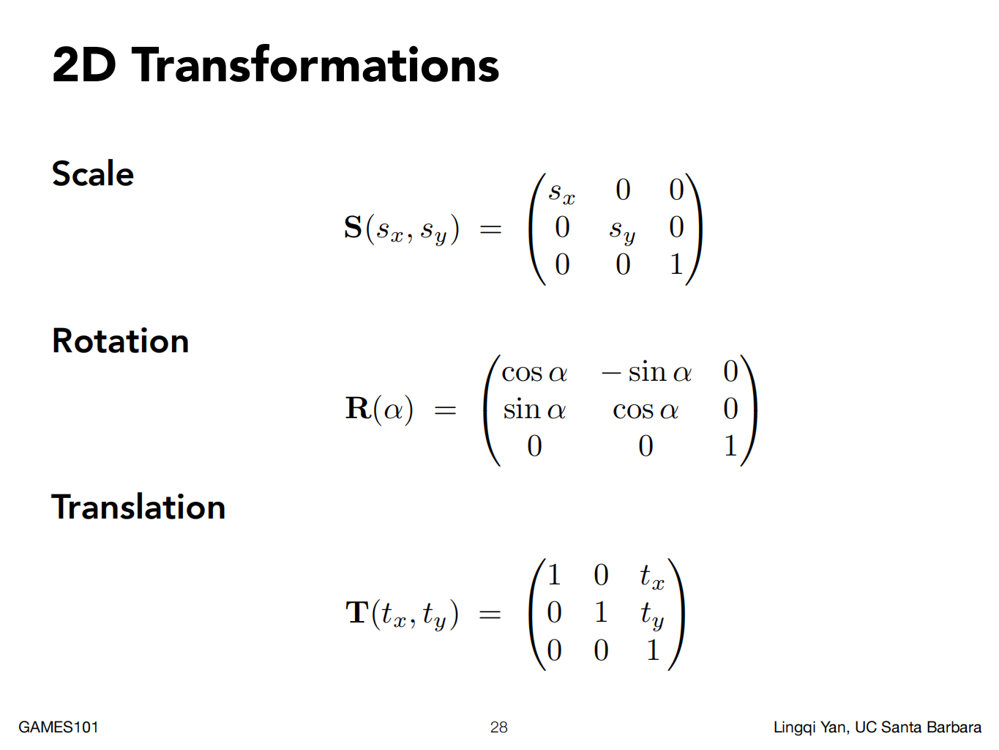

- Shear
    $
    \begin{bmatrix} x^{\prime}  \\y^{\prime}\end{bmatrix} = 
    \begin{bmatrix}1 & a \\0 & 1\end{bmatrix}
    \begin{bmatrix}x \\y\end{bmatrix}
    $
    
    具体方法，代入点算
    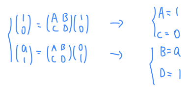  

    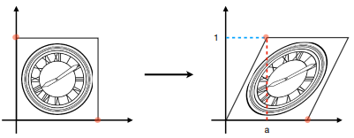  

- Scale
    $
    \begin{bmatrix} x^{\prime}  \\y^{\prime}\end{bmatrix} = 
    \begin{bmatrix}s_{x} & 0 \\0 & s_{y}\end{bmatrix}
    \begin{bmatrix}x \\y\end{bmatrix}
    $
    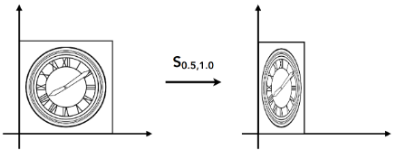  

- Reflection（沿着y轴对称）
    $
    \begin{bmatrix} x^{\prime}  \\y^{\prime}\end{bmatrix} = 
    \begin{bmatrix}-1 & 0 \\0 & 1\end{bmatrix}
    \begin{bmatrix}x \\y\end{bmatrix}
    $
    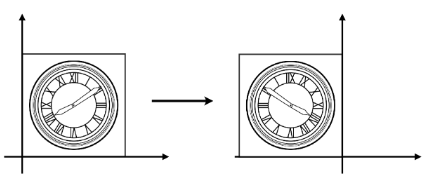  

- Rotate
    $
    \begin{bmatrix} x^{\prime}  \\y^{\prime}\end{bmatrix} = 
    \begin{bmatrix}\cos\theta & -\sin\theta \\\sin\theta & \cos\theta\end{bmatrix}
    \begin{bmatrix}x \\y\end{bmatrix}
    $
    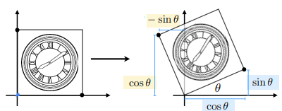  
    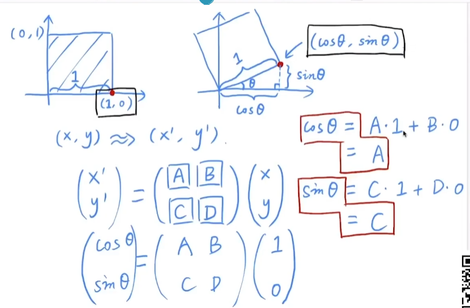  

- Translation
    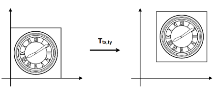  

## 3. 变化可逆

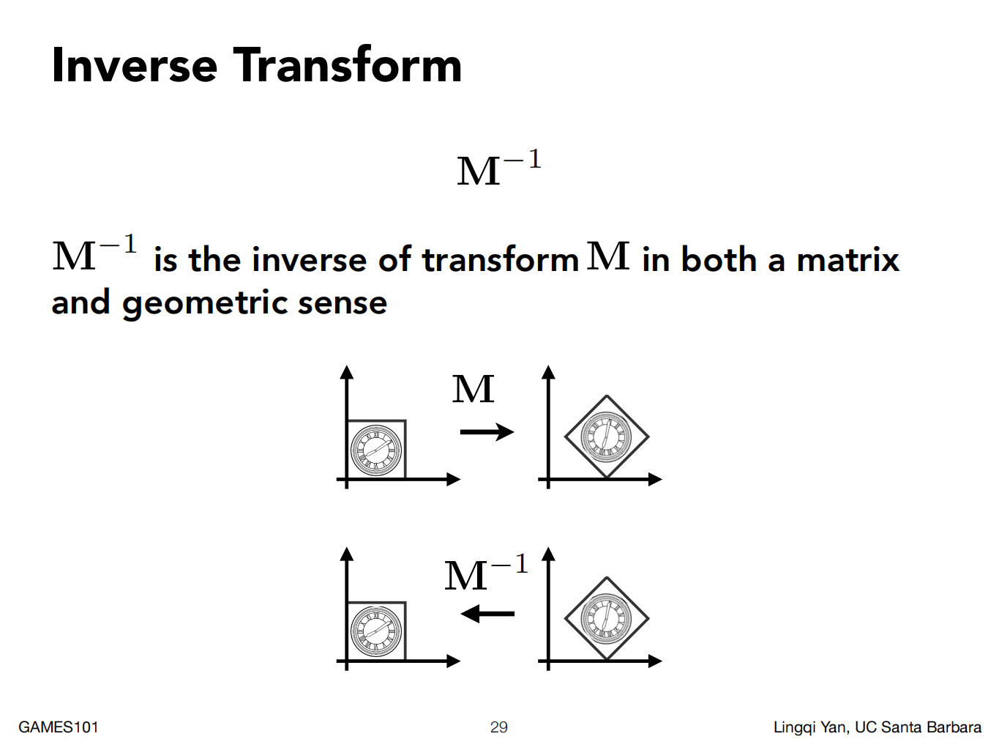
## 4. 顺序
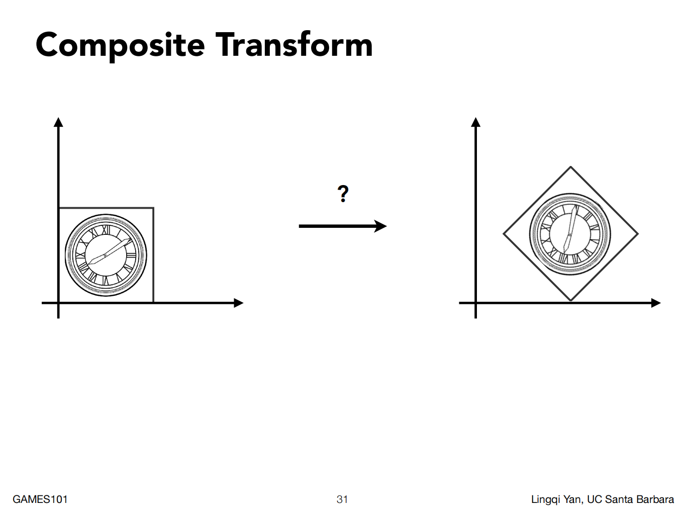
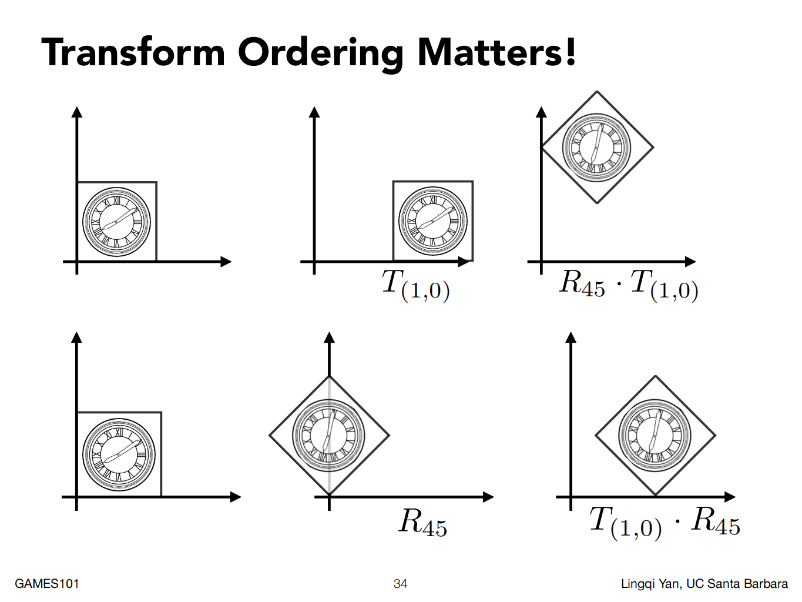
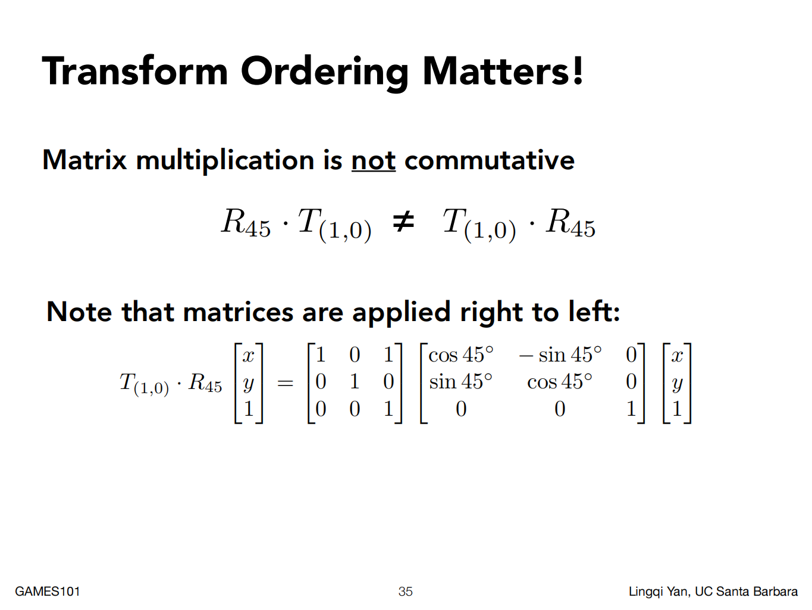
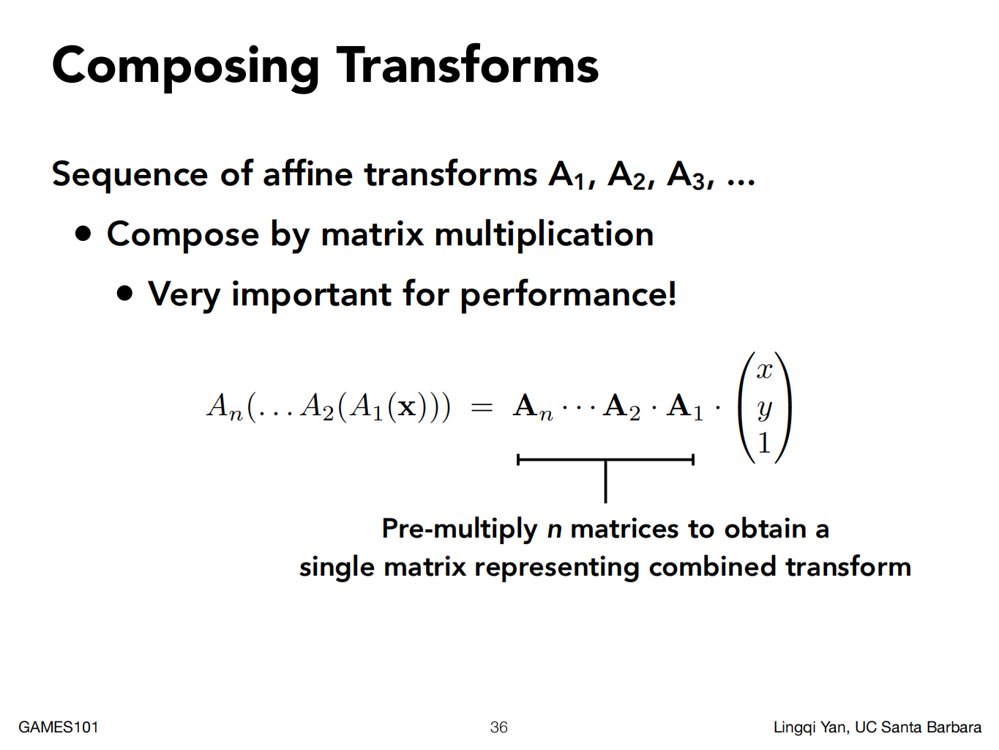

